# plant-disease-edge — the whole story, start to end

*Written 8 Aug 2026. Every number here is traceable to a JSON in `docs/paper/`; none are typed by
hand. Figures are the ones generated by `docs/paper/make_figures.py`.*

---

## 0. What we are actually building, in one paragraph

A farmer points a phone at a diseased leaf. The model must name the disease **offline, in real time,
on cheap hardware** — and, crucially, it must work on a crop nobody trained it on. Cloud
vision-language models (VLMs) can do this but cost roughly \$0.21–0.42 per image and need
connectivity. Our system is **one frozen compact CLIP image encoder** with two heads: a trained
classifier for crops we have data for, and a **zero-shot descriptor head** that diagnoses *unseen*
crops by matching the image to LLM-written, source-cited symptom descriptions. Only the image encoder
ships to the device (12.9 MB, 17.4 ms/image on a laptop CPU). Target venue: *Computers and Electronics
in Agriculture*, Special Issue "Foundation Models in Agriculture".

---

## 1. The journey — including everything that failed

This project reached its final architecture by **disproving three earlier ones**. That history is not
padding; the negative results are a contribution, and they are why the current design is defensible.

### Phase 0.1 — "Distill a big VLM into a tiny model" → **dead**

The original plan (inherited from an earlier repo) was knowledge distillation: take a strong
teacher VLM, compress it into a ~5 M-parameter student such as EdgeNeXt/EMOv2/iFormer.

Four runs, each fixing the previous one's flaw:

| Run | What changed | Student accuracy | Verdict |
|---|---|---|---|
| 1 | bare class-name prompts | — | **void** (held set collapsed to one crop) |
| 2 | CLIP-B/16 teacher, mimic loss | 11.6 % (54 % teacher retention) | no-go |
| 3 | + text-prototype anchoring | 11.0 % | no change |
| 4 | **SigLIP2** teacher, 4 train crops | 11.0 %, teacher 25.6 % | **decisive no-go** |

Run 4 is the important one. We gave the method its best shot — the strongest available teacher — and
the student *did not improve*. Retention actually fell across runs (54 → 52 → 43 %). That rules out
"the teacher wasn't good enough" and "we need more data" and points at the **student architecture**.

> **Conclusion:** a small ImageNet-style backbone cannot *learn* cross-modal image–text alignment from
> ~10 k images. Alignment must be **inherited** from large-scale pretraining. Distillation is dead.

### Phase 0.2 — "Then just use a pretrained small CLIP" → **this works**

We probed off-the-shelf compact CLIPs zero-shot, with no training at all. MobileCLIP2-S0 (11.4 M) hit
19.9 % on a 17-class held-out set — **3.4× chance, and ~2× the from-scratch student**, for free.

The second finding from that probe became a pillar of the paper: **accuracy is essentially flat from
11 M to 300 M parameters.**

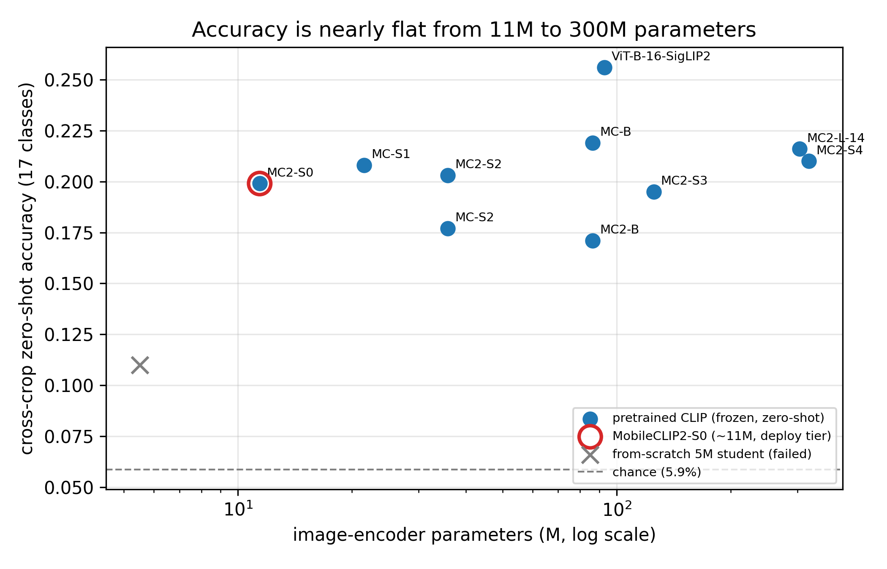

*Frozen pretrained CLIPs cluster at 17–22 % regardless of size, while the from-scratch 5 M student
(grey ✗) sits near chance. Size is not the bottleneck — pretrained alignment is the asset.*

### Phase 0.3 — "Fine-tune it on our crops to make it better" → **dead**

The obvious next move: specialise the frozen model on our seen crops to lift unseen-crop accuracy.
It went **backwards** — 19.9 % → 15.4 %, a 4.5 pp loss. Held-out accuracy fell as training loss fell:
textbook catastrophic forgetting, consistent with the WiSE-FT literature.

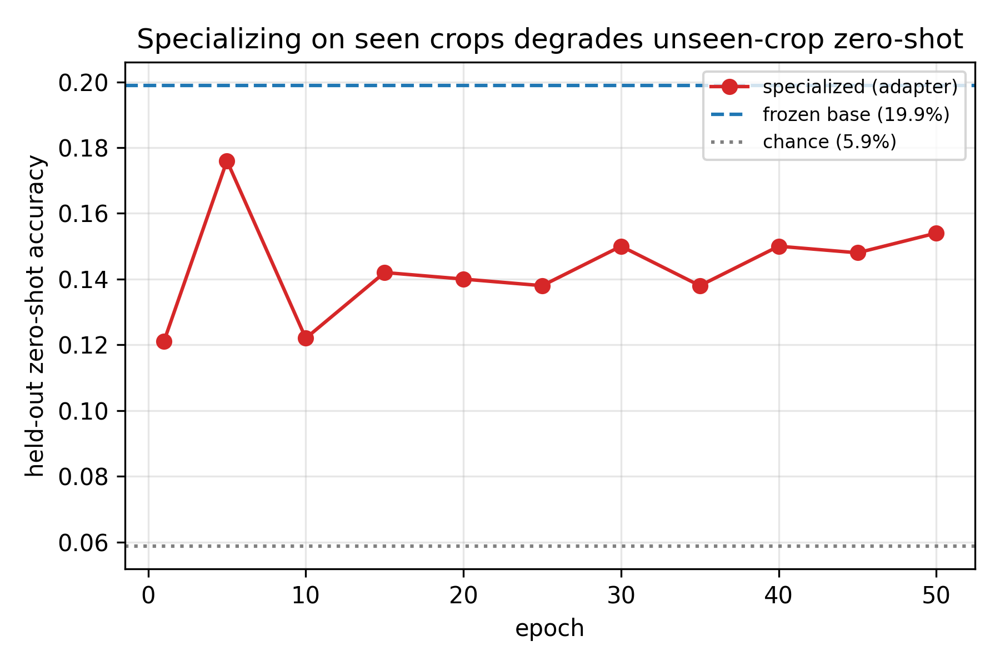

> **Conclusion:** training a small model does not improve *unseen*-crop zero-shot, by any route we
> tried. Keep the backbone **frozen**. Training is demoted to a seen-crop booster.

### Phase 0.4 — "What actually moves the needle?" → **the descriptors**

Everything so far used crude keyword prompts. We swapped in real symptom paragraphs and the numbers
jumped: +8 to +15 pp across models. One example is worth the whole ablation — Orange/Huanglongbing
went from **8.9 % → 95.6 %** on the 11 M model purely by describing the symptom properly.

That independently reproduced SAGE's reported +14–16 pp gain from symptom knowledge, but on **frozen
compact edge models** instead of a cloud agent. The headline relocated to where the evidence was:
*descriptor-driven cross-crop zero-shot on frozen compact VLMs.*

### Phase A–D — scale-up

We rebuilt the pipeline properly: 18 crops, a source-grounded descriptor generator, a clean nested
experimental design, abstention metrics, leave-one-crop-out, supervised baselines, and an edge
benchmark. Detail in §3–§5 below.

### Phase E — the reversal that improved the paper

Late in the project the nested scale study (§5.2) **overturned a claim the draft had been making for
weeks**. Details there — it is the single most important result in the project.

---

## 2. The final architecture

One **frozen** compact CLIP image encoder, plus four components:

1. **Trained seen-crop head** — linear probe on frozen features (166 classes at full scale).
2. **Zero-shot descriptor head** — nearest source-grounded text prototype by cosine similarity.
   This is what diagnoses crops the model never saw.
3. **WiSE-FT weight ensembling** — interpolate fine-tuned ⊕ frozen visual weights at ratio α, so
   seen-crop gains do not destroy unseen-crop generalisation.
4. **Abstain / OOD router** — top-1 − top-2 similarity margin; low margin → "unsure".

**Only the image encoder deploys.** Text prototypes are computed offline once and shipped as a small
matrix, so the text encoder never runs on-device.

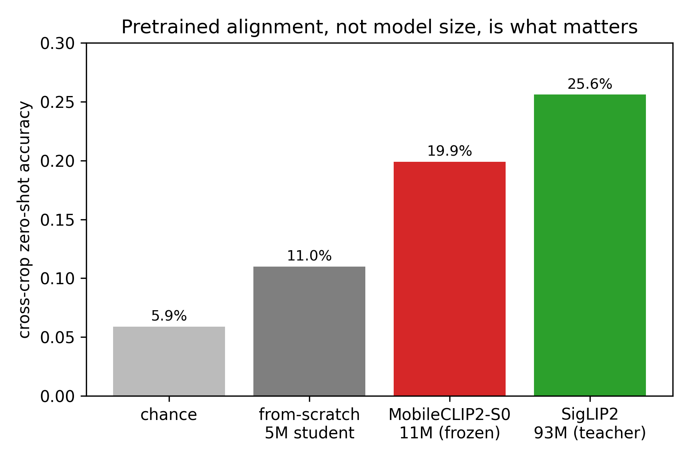

**Critical design constraint, worth stating explicitly:** zero-shot requires image–text alignment, so
the backbone *must* come from the CLIP family. **DINOv2 cannot do this** — it is vision-only, with no
text tower and therefore no way to match an image against a written symptom description. Any plan that
routes zero-shot through DINOv2 is broken at the root.

**Model family** (image-encoder parameters — the part that ships):

| Tier | Model | Params | Target device |
|---|---|---|---|
| Lightweight | MobileCLIP2-S0 | 11.4 M | phone / small NPU |
| Lightweight | MobileCLIP-S1 | 21.5 M | laptop CPU |
| Lightweight | MobileCLIP2-S2 | 35.8 M | laptop |
| Heavyweight | MobileCLIP-B | 86.3 M | workstation |
| Reference | ViT-B/16-SigLIP2 | 92.9 M | cloud ceiling |

---

## 3. Data and experimental design

**SAGE only** (`tirtho149/SAGE`, MIT, ~1.01 M images as Parquet shards). We deliberately dropped
PlantVillage / PlantDoc / PlantWild — they are lab-condition and old, and reviewers discount them.

The design that matters is **nesting**. Three configurations where every crop in A also appears in B,
and B in C, so differences are attributable to the *size of the label space* and not to which crops
happened to be picked:

| Config | Seen crops | Seen classes | Seen images | Held-out crops | Held-out classes | Chance |
|---|---|---|---|---|---|---|
| **A** | 4 | 97 | 42,326 | Coffee, Orange, Peach | 16 | 6.2 % |
| **B** | 8 | 154 | 62,043 | + Cotton, Wheat, Bean | 34 | 2.9 % |
| **C** | 10 | 166 | 69,919 | + Banana, Cucumber | 51 | 2.0 % |

Held-out crops are **never** trained on at any stage. They are diagnosed only from descriptor text.

### Source-grounded descriptors

Each disease gets `{symptom_text, fields:{pathogen, affected_organs, visual_symptoms}}`, and every
field carries `{value, source_url, verbatim_quote}`. An LLM generates these under a strict prompt that
forbids uncited claims.

**Coverage, stated precisely:** 156 of 217 records are filled; the other 61 are explicit stubs that
fall back to the hand-curated bank. Of the 156, **111 carry a verbatim quote but only 16 are
page-verified** — meaning we actually retrieved the page and copied the sentence. The other 95 quotes
are model-recalled and are *not* evidence.

Stub records hold a literal `"TODO: ..."` placeholder. We verified these never reach CLIP:
`scripts/descriptors.py` keys on `status == "filled"`, so a placeholder can never become a prototype.

---

## 4. Results

### 4.1 THE headline: only source-grounded descriptors scale

This is the result the paper is built on, and it **reversed** what we believed for weeks.

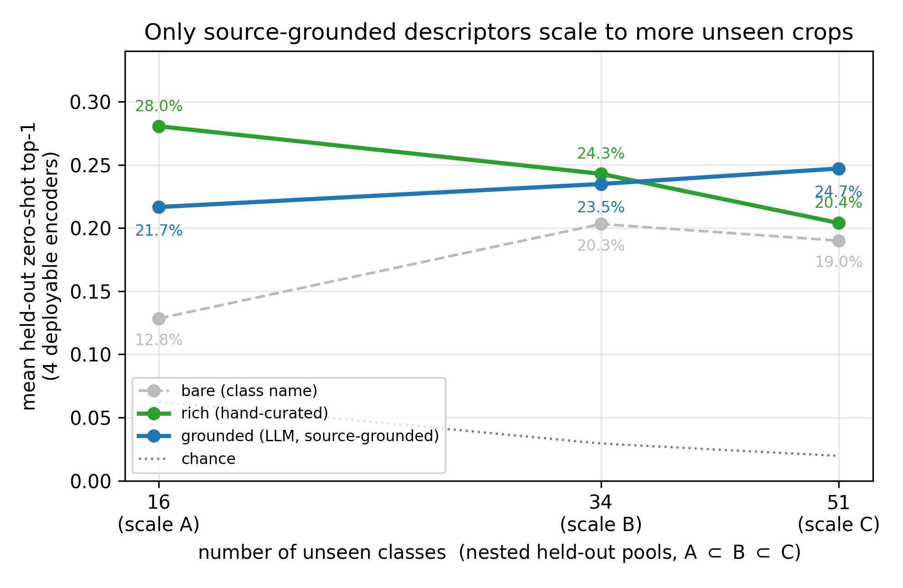

| Held-out scale | Classes | bare | rich (hand-curated) | grounded (source-grounded) |
|---|---|---|---|---|
| **A** | 16 | 12.8 % | **28.0 %** | 21.7 % |
| **B** | 34 | 20.3 % | 24.3 % | 23.5 % |
| **C** | 51 | 19.0 % | 20.4 % | **24.7 %** |

Read the two middle columns as trends, not points:

- **Hand-curated `rich` degrades**: 28.0 → 24.3 → 20.4 %
- **Source-grounded `grounded` improves**: 21.7 → 23.5 → 24.7 %

At 51 unseen classes, grounded beats rich for **all four encoders** (+2.7 to +5.2 pp, mean +4.3 pp).

**Why this matters more than the raw numbers.** Reading scale A alone — which is what the draft did for
weeks — you conclude "hand-curation wins slightly, so source-grounding is an auditability tax you pay
for equal accuracy." That conclusion is *wrong*, and only the nested design exposes it. The mechanism
is coverage: the hand-written bank was authored against three anchor crops and thins out as new crops
arrive, while the generated registry spans 156/217 classes with a uniform schema.

So auditability is not a tax. **Source-grounding is the only authoring route that reaches new crops at
all** — which is precisely the capability the paper claims. Hand-curation cannot scale because it needs
an expert per crop; a grounded generator needs only a source per crop.

The general lesson, which we now treat as process: **a single-split ablation cannot distinguish
"equally good" from "one of these scales."**

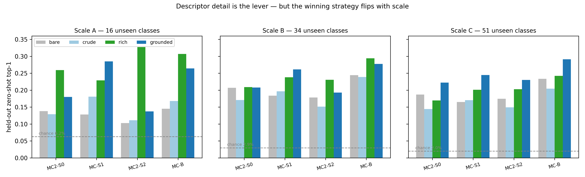

### 4.2 Encoder bake-off — generic beats domain-specific

| Encoder | Params | Rich zero-shot |
|---|---|---|
| **SigLIP2** | 92.9 M | **31.5 %** |
| MobileCLIP2-S2 | 35.8 M | 28.7 % |
| MobileCLIP2-S0 | 11.4 M | 27.0 % |
| MobileCLIP-S1 | 21.5 M | 22.4 % |
| BioCLIP2 | 304.0 M | 9.6 % |
| SCOLD | 237.5 M | 4.4 % |

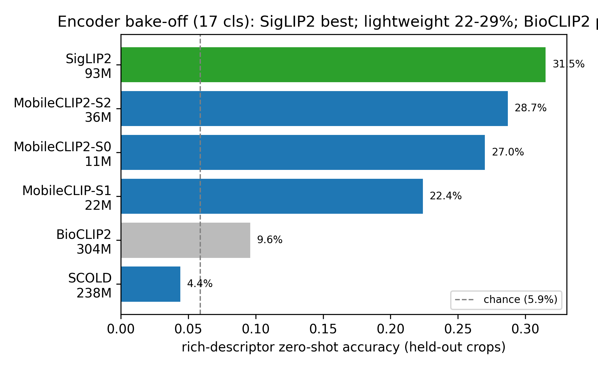

Two things stand out. The 11 M S0 recovers **86 % of SigLIP2 at 1/8 the parameters**, and it *beats*
the larger S1 — a training-recipe effect (MobileCLIP2/DFN vs older MobileCLIP/DataComp), reinforcing
that pretraining quality beats size.

More surprising: the **biological and domain-specific foundation models land at or below chance**.
Taxonomy-style pretraining does not align to symptom-descriptor text. *Caveat we state openly:* our
SCOLD wrapper is a best-effort load, and a faithful evaluation needs the authors' inference pipeline.
We do not lean on this result.

### 4.3 Abstention makes a modest top-1 field-useful

Raw cross-crop top-1 is 17–29 %. That sounds weak until you ask what a field tool actually needs: a
short list, and the honesty to say "unsure".

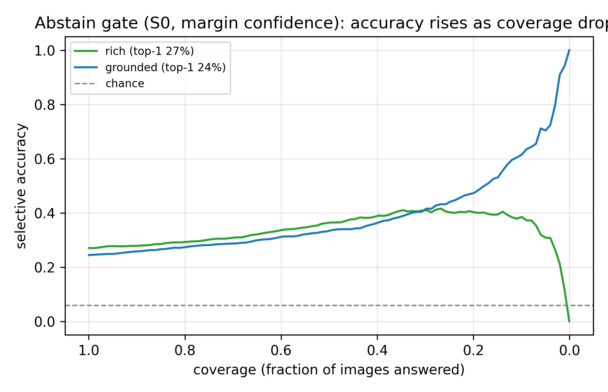

With grounded descriptors, **top-5 is 61–77 % at 16 classes and still 58–76 % at 51** (29–38× chance).
Selective accuracy rises monotonically as coverage tightens, confirming the confidence signal is
properly ordered rather than anti-calibrated. `grounded` also abstains best — lowest AURC and highest
top-5 — even where its top-1 does not lead.

### 4.4 Known crops: the seen head

On the full 166-class seen set the frozen backbone plus a linear probe reaches **82.4 %**, versus
9.3 % for the same encoder used zero-shot on those classes — a 7.2× gain confirming that supervised
training, not descriptors, is the right tool for known crops.

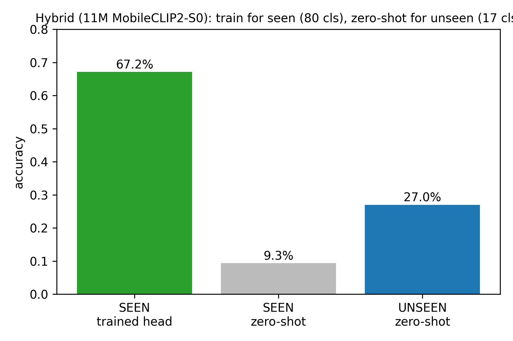

Running the probe at all three nested scales gives the seen-side counterpart to the descriptor study:

| Config | Seen classes | Seen images | MC2-S0 (11.4 M) | MC-S1 (21.5 M) | MC2-S2 (35.8 M) | MC-B (86.3 M) |
|---|---|---|---|---|---|---|
| A | 97 | 42,326 | 78.9 % | 77.7 % | 78.8 % | 79.3 % |
| B | 154 | 62,043 | 80.7 % | 79.2 % | 80.8 % | 80.9 % |
| C | 166 | 69,919 | **82.4 %** | 81.1 % | 82.5 % | 82.6 % |

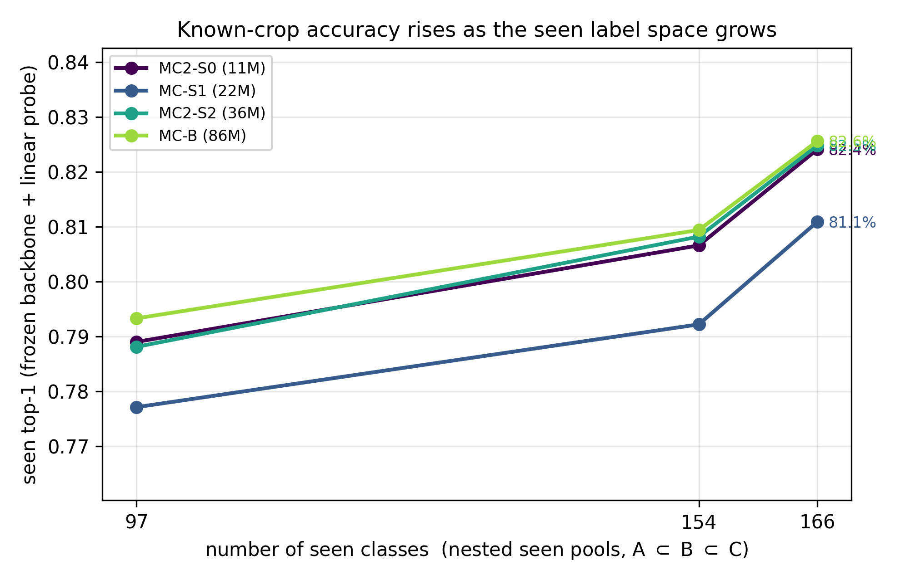

Two things fall out. Accuracy is **flat across a 7.6× parameter range** (≤1.5 pp spread at every
scale), mirroring the zero-shot result from the opposite direction — the strongest single argument for
deploying the 11 M tier. And accuracy **rises** with the label space (+3.3 to +3.5 pp for every
encoder), the *opposite* of the unseen side, because adding crops adds proportionally more training
images than decision difficulty.

That asymmetry is the real case for the hybrid: on the unseen side more classes make the problem
harder, on the seen side they make it easier, so each head is deployed exactly where its scaling
behaviour is favourable.

*Reproducibility:* config C measured twice three weeks apart on independently rebuilt caches agrees to
**0.15 pp** (S0) and **0.06 pp** (S1); a separate implementation run agrees within 0.2 pp on all four
encoders. Worth having in a paper that is otherwise single-seed.

### 4.5 WiSE-FT turns the seen/unseen trade-off into a dial

| α | Seen | Unseen (zero-shot) |
|---|---|---|
| 0.0 (frozen) | 82.6 % | 17.0 % |
| **0.5 (WiSE-FT)** | **87.7 %** | **16.3 %** |
| 1.0 (naive fine-tune) | 90.3 % | 8.8 % |

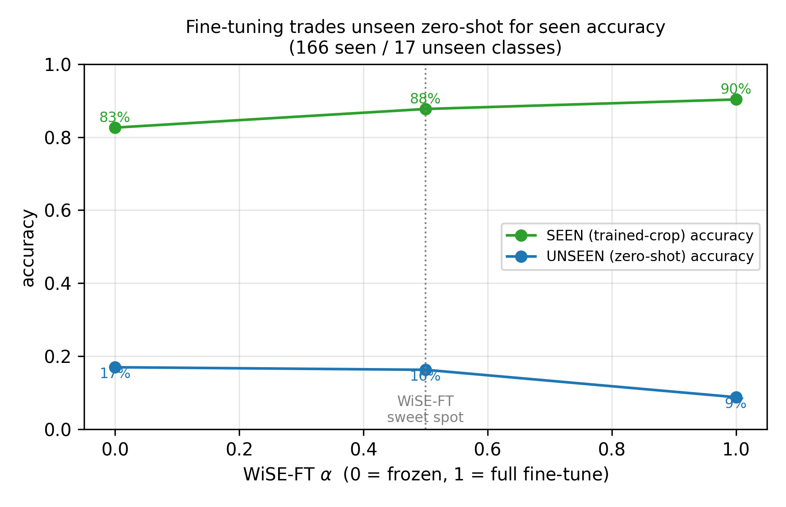

Naive fine-tuning is catastrophic forgetting made visible: seen rises to 90.3 % while unseen **halves**.
α = 0.5 buys **+5.1 pp seen for −0.7 pp unseen** — nearly free.

### 4.6 Supervised CNNs: better on seen, structurally incapable on unseen

| Architecture | Params | Seen top-1 | Unseen |
|---|---|---|---|
| ResNet-50 | 25.6 M | **88.4 %** | **0 (structural)** |
| MobileNetV3-Small | 2.5 M | 84.3 % | **0 (structural)** |
| MobileNetV4-Conv-Small | 3.8 M | 84.1 % | **0 (structural)** |

We report this plainly: **for a fixed, known label set a CNN is the better classifier.** But none of
them has an output neuron for an unseen class, so cross-crop accuracy is not merely low — it is
undefined. That gap is the entire point of the descriptor head.

> **Being straight about this table: it is 3 of 14 planned architectures, and the three are not
> mutually comparable** — MobileNetV4 trained for 6 epochs against 8 for the others, so part of the
> 84.1 % vs 88.4 % gap is undertraining rather than architecture. A `tf_efficientnetv2_s` run reached
> **85.2 % after a single epoch** before being interrupted and lost (the runner restarted interrupted
> architectures from scratch because it never passed `--resume` — now fixed), so the "best CNN =
> 88.4 %" figure is probably an underestimate. A full 14-architecture sweep at one protocol is running
> on Kaggle via `kaggle/cnn_baselines_notebook.py`; §5.8 and `tab_supervised.tex` regenerate from the
> new JSONs automatically. Expect the gap over the frozen probe to *widen* — that is the honest
> version of a point the paper already concedes, and it makes structural incapability, not accuracy,
> the load-bearing argument.

### 4.7 Leave-one-crop-out: the held crops are not cherry-picked

Pooled 16.0 % over 58 classes (chance 1.7 %). The held-out crops land **in the middle** of the range —
a *trained* crop (Corn, 32.9 %) is easiest and two *trained* crops (Apple 11.8 %, Potato 8.1 %) are
hardest. Difficulty tracks symptom distinctiveness, not train/held membership.

### 4.8 On-device, and an INT8 result with real reach

| Tier | Params | ONNX FP32 | INT8 dynamic | INT8 static | FP32 size | INT8 size |
|---|---|---|---|---|---|---|
| **S0** | 11.4 M | **17.4 ms** | 320.0 ms | 62.2 ms | 45.8 MB | **12.9 MB** |
| S1 | 21.5 M | 33.7 ms | 614.9 ms | 79.5 ms | 86.5 MB | 24.3 MB |
| S2 | 35.8 M | 49.2 ms | 923.8 ms | 98.7 ms | 143.6 MB | 39.2 MB |
| B | 86.3 M | 100.8 ms | 60.4 ms | **46.4 ms** | 345.6 MB | 87.4 MB |

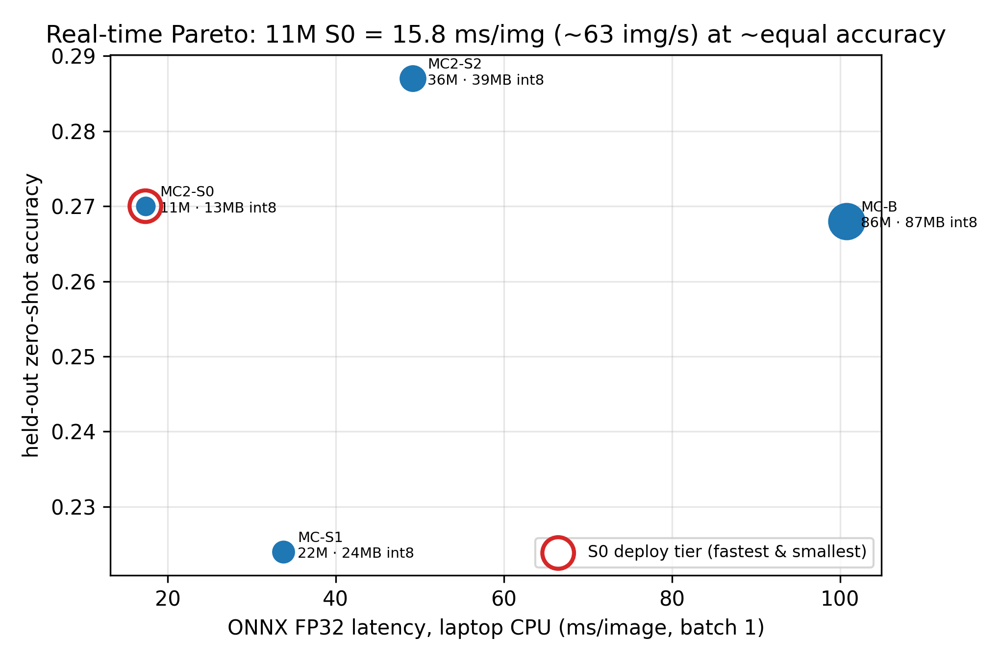

S0 runs at **17.4 ms/image (~58 img/s) on a commodity laptop CPU**. Then the interesting part: the
standard tutorial advice — "quantise to INT8 for edge" — makes the lightweight tiers **18–19× slower**.
A properly configured static QDQ pipeline recovers 5–9× but still loses to FP32 on the S-tiers. The
pure-transformer B behaves oppositely and gets **2.2× faster**.

The graph explains it. Counting convolutions the quantiser could not convert: **119 / 215 / 235** on
the hybrids versus **3** on the pure ViT. The hybrids must dequantise → float-conv → requantise
hundreds of times per inference.

> **Practical rule:** for hybrid conv–transformer encoders on a CPU runtime, INT8 is a **size** lever,
> not a **speed** lever. Deploy FP32. For transformer encoders it is both.

---

## 5. Repository map

```
scripts/            the real pipeline (frozen-VLM method)
  config.py           model tiers, nested A/B/C crop pools, paths
  sage_data.py        resumable Parquet-shard fetch + dedup
  descriptors.py      bare/crude/rich/grounded strategies + grounded loader
  zeroshot.py         frozen eval core
  evaluate.py         DRIVER: model × strategy sweep    -> zeroshot_eval_{A,B,C}.json
  metrics.py          top-5 + risk-coverage/AURC        -> metrics_abstain_{A,B,C}.json
  probe_seen_all.py   seen-head probe, all configs, cached + resumable
  loco.py             leave-one-crop-out + bootstrap CIs
  supervised_baseline.py / run_cnn_baselines.py   CNN baselines
  build_descriptors.py / audit_descriptors.py / apply_verified_citations.py

kaggle/             Kaggle/Windows-flavoured runners + benchmark_quantization.py
descriptors/        18 crop JSONs — the source-grounded registry
docs/paper/         paper.md, findings_log.md, ALL result JSONs, generators, figures/
logs/               every run log, indexed by logs/README.md
results/onnx/       exported FP32/FP16/INT8 graphs
```

**Runbooks:** `RUNBOOK.md` (master), `RUNBOOK_GPU.md` (what's left, verified commands),
`kaggle/RUNBOOK_KAGGLE.md` (free-tier plan around the 20 GB disk limit).

### Reproducing everything

```bash
python scripts/evaluate.py --exp C --heavy      # zero-shot sweep
python scripts/metrics.py  --exp C --reference  # top-5 + abstention
python scripts/probe_seen_all.py                # seen head, A/B/C
python scripts/loco.py                          # leave-one-crop-out
python kaggle/benchmark_quantization.py         # edge latency/size + INT8 diagnosis
python docs/paper/make_tables.py --write        # regenerate every table
python docs/paper/make_figures.py               # regenerate every figure
```

**Interpreter gotcha:** use `C:\Users\PV Abhiram\.pyenv\pyenv-win\versions\3.11.9\python.exe`. The bare
`python` on PATH is an unrelated venv with nothing installed — the most common way these runs fail.

---

## 6. Process failures, and the fixes that came out of them

Being honest here because these cost real time.

**Number drift — three separate incidents.** The manuscript disagreed with the data three times: a
stale 17-class eval, a superseded edge benchmark, and a *third* hardcoded latency set living inside
`make_figures.py`. Root cause: numbers were transcribed by hand.
**Fix:** `make_tables.py` now generates every table straight from the result JSONs, and
`make_figures.py` reads the same files instead of hardcoding them. The rule is absolute — *never type a
result into the paper.*

**A fabricated number.** While rewriting §5.5 an "8.6 % seen zero-shot" figure was written that exists
in no JSON. Caught by cross-checking against source files. It is now the measured 9.3 % → 67.0 %.

**Pool drift, invisible by design.** `probe_seen.py` derives its class list from whatever SAGE shards
are on disk, and it *printed* the image count without *saving* it. So a config-A run in August (97
classes) looked comparable to a config-C run from July (166 classes) when it was not.
**Fix:** the image count is persisted, and `make_tables.py` refuses to silently tabulate a config whose
JSON predates that field.

**Concurrent writes.** Two probe jobs — one started by hand, one by the agent — wrote the same result
paths, and the agent's run **overwrote a completed 4-model result**. Nothing was lost permanently
(re-measured), but the lesson stands: check for a running job before launching one that writes shared
paths.

**A misdiagnosis worth recording.** Embedding throughput "stalled" repeatedly and was blamed on Windows
DataLoader multiprocessing; the loader was rewritten twice. The real cause was **GPU contention with
the other job on the same machine**. Check `Get-Process python` before rewriting code.

**Non-determinism.** `fit_probe` seeded `random` (the train/test split) but not torch (minibatch
order), leaving ~0.2 pp of run-to-run drift on identical cached embeddings. Both are now seeded.

**Reproducibility, on the plus side.** Config C re-measured three weeks apart agrees to **0.15 pp**
(S0: 82.71 vs 82.56) and **0.06 pp** (S1: 81.19 vs 81.25). For a single-seed paper that is a cheap,
genuine answer to "how stable is this?"

---

## 7. Is the paper ready to submit today?

**The science is ready. The submission package is not.** Being direct about this because it is easier
to hear now than after a desk rejection.

### Hard blockers — a desk reject without them

| # | Blocker | Status |
|---|---|---|
| 1 | **References** — there was no bibliography at all | ✅ **done** — `docs/paper/tex/refs.bib` + a References section in `paper.md`. **But 7 entries are flagged `UNVERIFIED`**, including SAGE itself, the dataset the whole paper rests on. Those need checking against the published record. |
| 2 | **Authors, affiliations, corresponding-author email** | ❌ **only you** — search `ACTION` in `tex/main.tex` |
| 3 | **Elsevier format** — CEA needs LaTeX or Word, not Markdown | ✅ **done** — `tex/main.tex` in `elsarticle`, tables `\input` from generated files |
| 4 | **Front matter** — Highlights, competing interests, CRediT, data availability | ✅ **drafted** — CRediT roles still need real names; funding/grant numbers are yours |

### Should fix, will likely be raised by a reviewer

- **Single seed, no confidence intervals** on the headline claim. Grounded-beats-rich (+4.3 pp) is the
  paper's central result and it is one point estimate. This is my main reservation about submitting.
  Partial mitigation now in §5.5: the seen probe reproduces to 0.15 pp across a three-week gap and to
  0.2 pp across a separate implementation — but that is stability of *one* measurement, not a CI on
  the headline.
- **CNN baseline sweep** — running on Kaggle now (see §4.6). Regenerates into the paper automatically.
- **18 dead source URLs** in the descriptor registry — an auditability paper should not ship dead
  citations.
- **Only 16 of 111 quotes are page-verified.** Stated honestly in §7, but a reviewer may push.
- **No ARM/Raspberry Pi latency row.** The deployment claim is CPU-x86 only, and ARM NEON may well
  reverse the INT8 finding — which would make §5.10 stronger, not weaker.
- **Figures are 160 dpi.** Elsevier wants ≥300 dpi for raster art (one-line change in
  `make_figures.py`: `dpi=160` → `dpi=300`).

### What is genuinely strong

- A real, non-obvious headline finding with a mechanism, that **reversed a prior belief** — reviewers
  respect that far more than a tidy story.
- Rigorous negatives (distillation fails, fine-tuning forgets, CNNs structurally cannot transfer).
- Anti-cherry-pick evidence (leave-one-crop-out with bootstrap CIs).
- A quantisation result with practical reach beyond agriculture.
- Fully reproducible: every table and figure regenerates from committed JSONs.

**My honest recommendation:** you have until **30 September**. Submitting today means submitting
without a bibliography and with placeholder authors, which wastes the work. Items 1–4 are perhaps a
solid day. Add three seeds and the dead URLs and you have a genuinely strong submission inside a week.
